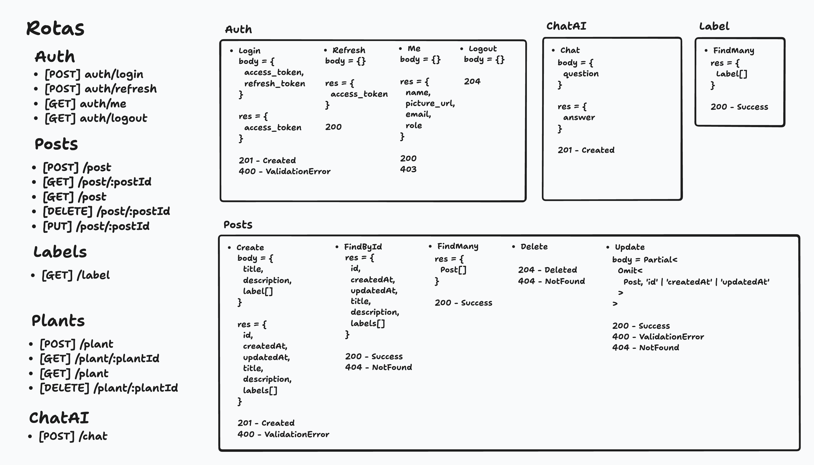

# 3.5. Iniciativas Extras (Padrões de Projeto)

## Planejamento das Rotas

Para facilitar e agilizar a integração entre o front-end e o back-end, foi definido um esquema de rotas que será utilizado.

<b>Autor:</b> [Arthur Ribeiro e Sousa](https://github.com/artrsousa1), [Caio Felipe Rocha](https://github.com/caio-felipee), [Mateus Vieira Rocha da Silva](https://github.com/mateusvrs), [Caio Lamego](https://github.com/caiolamego) e [Matheus Brant](https://github.com/MatheussBrant), 2025 

| Versão | Data       | Alterações Principais                             | Autor(es)                   |
|--------|------------|---------------------------------------------------| --------------------------- |
| 0.0.1  | 29-05-2025 | Adição do planejamento das rotas                  | Caio Felipe, Mateus Vieira e Arthur Ribeiro |
