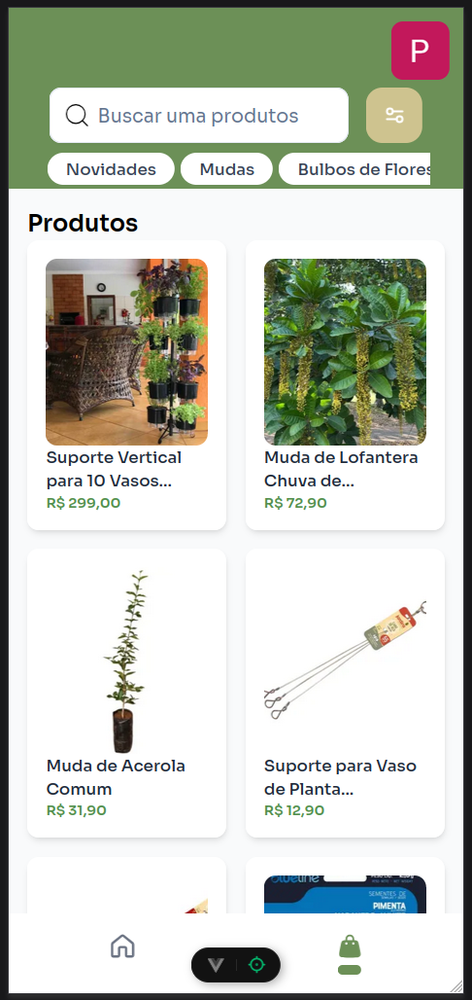

# 3.5. Iniciativas Extras (Padrões de Projeto)

## Planejamento das Rotas

Para facilitar e agilizar a integração entre o front-end e o back-end, foi definido um esquema de rotas que será utilizado.

<b>Autor:</b> [Arthur Ribeiro e Sousa](https://github.com/artrsousa1), [Caio Felipe Rocha](https://github.com/caio-felipee), [Mateus Vieira Rocha da Silva](https://github.com/mateusvrs), [Caio Lamego](https://github.com/caiolamego) e [Matheus Brant](https://github.com/MatheussBrant), 2025 

## Front-end

Implementação de páginas no frontend

   <h3>ShoppingView</h3>
   

<b>Autor:</b> [Mateus Vieira Rocha da Silva](https://github.com/mateusvrs), [Caio Lamego](https://github.com/caiolamego) e [Caio Falcão](https://github.com/CaioHabibe), 2025 

   <h3>ProductView</h3>
   

<b>Autor:</b> [Mateus Vieira Rocha da Silva](https://github.com/mateusvrs), [Caio Lamego](https://github.com/caiolamego) e [Caio Falcão](https://github.com/CaioHabibe), 2025 

   <h3>ProfileView</h3>
   

<b>Autor:</b> [Mateus Vieira Rocha da Silva](https://github.com/mateusvrs), [Caio Lamego](https://github.com/caiolamego) e [Caio Falcão](https://github.com/CaioHabibe), 2025 

   <h3>NewPostView</h3>
   

<b>Autor:</b> [Mateus Vieira Rocha da Silva](https://github.com/mateusvrs), [Caio Lamego](https://github.com/caiolamego) e [Caio Falcão](https://github.com/CaioHabibe), 2025 

## Label & Post Use Cases

Além das iniciativas mencionadas, foram realizadas as seguintes contribuições:

1. **[Criação do Repository Label](https://github.com/UnBArqDsw2025-1-Turma02/2025.1-T02-G3_PlanteVcMesmo_Entrega_03/pull/29/commits/c54ab79486bfd9bb6836d7f939a57f2d8ac5bafe)**  
   Implementação de um repositório para gerenciar as labels utilizadas no sistema, promovendo organização e reutilização de código.

2. **[Criação dos Use Cases para Post](https://github.com/UnBArqDsw2025-1-Turma02/2025.1-T02-G3_PlanteVcMesmo_Entrega_03/pull/31)**  
   - **[CreatePostUseCase](https://github.com/UnBArqDsw2025-1-Turma02/2025.1-T02-G3_PlanteVcMesmo_Entrega_03/pull/31/commits/a2ef4ab14aae0f615a05e849e81f2efcff72c721)**: Desenvolvimento do caso de uso responsável por criar novos posts, garantindo a validação e persistência dos dados.
   - **[DeletePostUseCase](https://github.com/UnBArqDsw2025-1-Turma02/2025.1-T02-G3_PlanteVcMesmo_Entrega_03/pull/31/commits/15e7464ba329d36c9be46d4e0707f27c10d9cf8d)**: Implementação do caso de uso para exclusão de posts, assegurando a integridade e consistência do sistema.

Essas contribuições foram realizadas com o objetivo de melhorar a modularidade e a escalabilidade do sistema, seguindo os princípios de boas práticas de desenvolvimento.

<b>Autor:</b> [Rafael Melo Matuda](https://github.com/rmatuda), 2025 

| Versão | Data       | Alterações Principais                             | Autor(es)                   |
|--------|------------|---------------------------------------------------| --------------------------- |
| 0.0.1  | 29-05-2025 | Adição do planejamento das rotas                  | Caio Felipe, Mateus Vieira e Arthur Ribeiro |
| 0.0.2  | 01-05-2025 | Adição das telas do FrontEnd                      | Caio Lamego e Caio Falcão |
| 1.0.0  | 02-05-2025 | Tamanho das imagens Frontend                      | Mateus Vieira |
