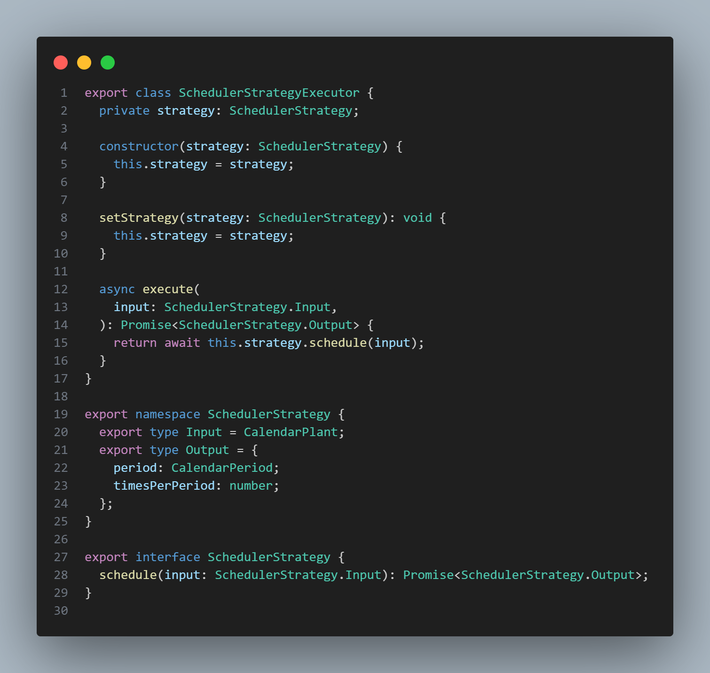
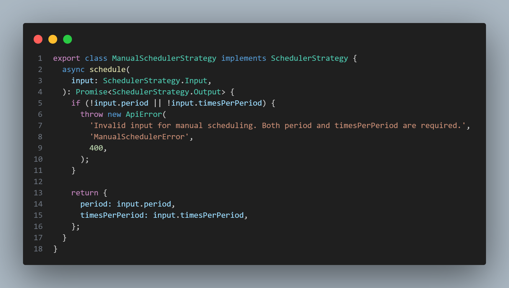
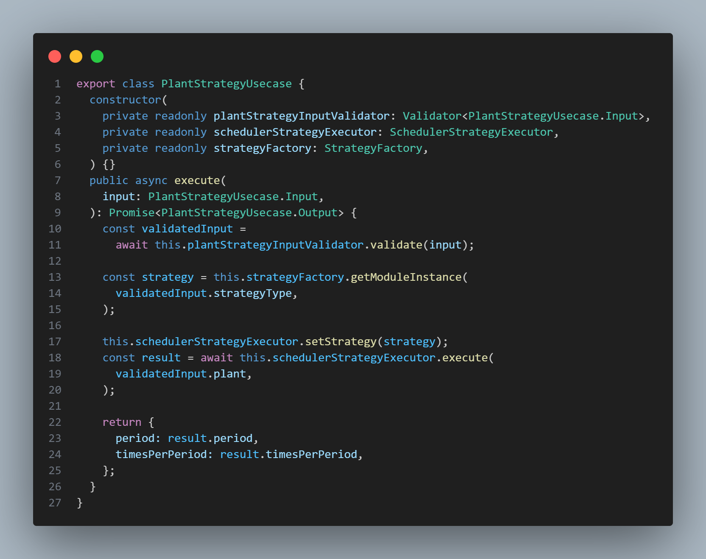

# 3.3.1. Strategy

## Introdução

O padrão Strategy é um padrão de design comportamental que permite definir uma família de algoritmos, encapsulá-los e torná-los intercambiáveis durante a execução do programa (Gamma et al., 1994, p. 315)<a href="https://unbarqdsw2025-1-turma02.github.io/2025.1-T02-G3_PlanteVcMesmo_Entrega_03/#/./PadroesDeProjeto/GoFsComportamentais/strategy?id=referências"><b>1</b></a>. Este padrão é especialmente útil quando existe a necessidade de alternar entre diferentes abordagens para resolver um mesmo problema, sem modificar o código cliente que utiliza esses algoritmos. No contexto do Plante Vc Mesmo, o Strategy se mostra fundamental para gerenciar as diferentes estratégias de cuidado que variam conforme o tipo de planta, estação do ano, condições ambientais e preferências do usuário, proporcionando flexibilidade e extensibilidade ao sistema.

## Aplicação no Projeto

O padrão de design Strategy mostrou-se uma solução eficaz para a criação do perfil de uma planta no processo de agendamento de cuidados. Esse padrão permite a implementação e aplicação dinâmica de diferentes estratégias de cuidado.

No nosso projeto, utilizamos essa abordagem para diferenciar dois modos de criação do perfil de uma planta: a criação manual e a criação automática. Dessa forma, o usuário tem a liberdade de escolher como deseja configurar o perfil da planta.

As estratégias se distinguem principalmente pelo uso de inteligência artificial na definição do período de rega. Na estratégia automática, a IA é responsável por sugerir os parâmetros ideais, enquanto na estratégia manual, o próprio usuário define esses parâmetros diretamente.

### Aprofundamento de Informações

A ideia de incluir essas informações surgiu durante uma discussão em [Pull Request](https://github.com/UnBArqDsw2025-1-Turma02/2025.1-T02-G3_PlanteVcMesmo_Entrega_03/pull/3#discussion_r2106276801) no repositório do projeto. Nessa conversa, foi levantada a necessidade de um conjunto de dados que seriam opcionais caso o usuário optasse por criar o perfil da planta manualmente. No entanto, para a criação automática, essas informações se tornaram essenciais para ajudar a definir o período ideal de rega.

Os campos foram definidos com base na experiência da equipe com cuidados de plantas, além de sugestões obtidas por meio de prompts com IA. A IA confirmou a relevância desses dados e também sugeriu outros, como o tipo de solo. No entanto, optamos por não incluir esse campo agora, para manter o aplicativo mais simples e acessível, principalmente para o público leigo.

Os campos definidos para o perfil da planta, até o momento, são:

- Nome da planta
- Nome da espécie
- Local aberto/fechado (escolha binária)
- Local iluminado/não iluminado (escolha binária)
- Estado (UF) para definição do tipo do clima do ambiente

## Vantagens e Justificativas

A adoção do padrão de projeto Strategy oferece uma vantagem ao possibilitar a troca de algoritmos de forma dinâmica, sendo uma alternativa ao uso de condicionais para escolha de comportamentos desejados (Gamma et al., 1994, p. 317)<a href="https://unbarqdsw2025-1-turma02.github.io/2025.1-T02-G3_PlanteVcMesmo_Entrega_03/#/./PadroesDeProjeto/GoFsComportamentais/strategy?id=referências"><b>1</b></a>. Essa característica contribui diretamente para a flexibilidade e adaptabilidade da aplicação, permitindo a inclusão de novas estratégias de maneira simples e sem a necessidade de grandes alterações no código existente<a href="https://unbarqdsw2025-1-turma02.github.io/2025.1-T02-G3_PlanteVcMesmo_Entrega_03/#/./PadroesDeProjeto/GoFsComportamentais/strategy?id=referências"><b>2</b></a>. 

No contexto do projeto, caso surjam novas ideias relacionadas aos cuidados com plantas, como perfis pré-definidos, elas poderão ser facilmente atendidas por novas classes com diferentes implementações da interface da Strategy. Assim, o sistema permanece extensível e preparado para futuras evoluções.

## Modelagem

Com base na seção Aplicação no Projeto, foi elaborada uma modelagem semelhante a um Diagrama de Classes (Figura 1), que servirá como protótipo para a futura implementação do sistema. Nessa modelagem, o padrão Strategy é aplicado para permitir diferentes formas de agendamento, através da interface *SchedulerStrategy* e suas implementações: *ManualStrategy* e *AutomaticStrategy*.

A classe *Scheduler* define os métodos para configurar e executar a estratégia escolhida. A classe *AutomaticStrategy* utiliza o *LLMProvider* para apoiar decisões automáticas no agendamento, baseando-se em algum sistema de IA. O provedor da IA será instanciado por meio de classes Factory, conforme o identificador do modelo utilizado. Para entender melhor a utilização do Factory no projeto, acesse: [3.1.1. Factory](./PadroesDeProjeto/GoFsCriacionais/factory.md)

<b>Figura 1:</b> Modelagem do Strategy 

<b>Autor:</b> [Mateus Vieira Rocha da Silva](https://github.com/mateusvrs), 2025 

## Implementação

A interface ``SchedulerStrategy`` (Figura 2) define a operação comum, schedule, que cada estratégia concreta (``ManualSchedulerStrategy`` e ``AutomaticSchedulerStrategy``) deve implementar. A ``ManualSchedulerStrategy`` (Figura 3) lida com agendamentos definidos pelo usuário com base em um período e frequência específicos, enquanto a ``AutomaticSchedulerStrategy`` utiliza um modelo de linguagem grande (LLM Gemini) para sugerir um cronograma, considerando características da planta e do ambiente.

O nosso ``SchedulerStrategyExecutor`` (Figura 2) atua como o contexto, mantendo uma referência para a estratégia de agendamento atualmente selecionada e delegando a execução da tarefa schedule a ela. A ``StrategyFactory`` é responsável por instanciar a estratégia (Manual ou Automatic) com base na escolha do usuário, garantindo que o ``PlantStrategyUsecase`` (o cliente, Figura 4) interaja apenas com a interface genérica do agendador, sem se preocupar com a implementação de cada algoritmo. 

Os PRs responsáveis pela implementação do strategy podem ser conferidos nos links abaixo:
* [feat: chat llm and scheduler strategy #27](https://github.com/UnBArqDsw2025-1-Turma02/2025.1-T02-G3_PlanteVcMesmo_Entrega_03/pull/27)
* [feat: general fixes for post and strategy #35](https://github.com/UnBArqDsw2025-1-Turma02/2025.1-T02-G3_PlanteVcMesmo_Entrega_03/pull/35) 

<b>Figura 2:</b> Interface ``SchedulerStrategy`` e ``SchedulerStrategyExecutor``, que atua como contexto

<b>Autor:</b> [Arthur Ribeiro e Sousa][artrsousa1], [Caio Felipe Rocha][caio-felipee], [Caio Magalhães Lamego][caiolamego], [Gabriel Fernando De Jesus Silva][MMcLovin], [Mateus Vieira Rocha da Silva][mateusvrs], [Rafael Melo Matuda][rmatuda], 2025 

<b>Figura 3:</b> Strategy concreta de cronograma manual 

<b>Autor:</b> [Arthur Ribeiro e Sousa][artrsousa1], [Caio Felipe Rocha][caio-felipee], [Caio Magalhães Lamego][caiolamego], [Gabriel Fernando De Jesus Silva][MMcLovin], [Mateus Vieira Rocha da Silva][mateusvrs], [Rafael Melo Matuda][rmatuda], 2025 

<b>Figura 4:</b> Uso do strategy dentro da lógica de use case 

<b>Autor:</b> [Caio Felipe Rocha][caio-felipee], 2025 

## Referências

1. Gamma, E., Helm, R., Johnson, R., & Vlissides, J.. Design Patterns: Elements of Reusable Object-Oriented Software. Addison-Wesley, 1994. p. 315-324. Disponível em: https://www.javier8a.com/itc/bd1/articulo.pdf. Acesso em: 30 mai. 2025
2. Refactoring Guru. Strategy Pattern. Disponível em: [https://refactoring.guru/design-patterns/strategy](https://refactoring.guru/design-patterns/strategy). Acesso em: 28 mai. 2025.

## Histórico de Versões

| Versão | Data       | Alterações Principais                             | Autor(es)        |
|--------|------------|---------------------------------------------------| ---------------- |
| 1.0.0  | 22-05-2025 | Criação do Documento do padrão de projeto Strategy| [Davi Araújo Bady Casseb][dcasseb]      |
| 1.1.0  | 28-05-2025 | Recriação dos textos e referências                | [Caio Felipe Rocha][caio-felipee]      |
| 1.1.1  | 29-05-2025 | Imagem da modelagem e descrição                   | [Mateus Vieira Rocha da Silva][mateusvrs]    |
| 1.1.2  | 30-05-2025 | Conferindo bibliografia e atribuindo citações     | [Gabriel Fernando De Jesus Silva][MMcLovin] |
| 1.1.4  | 01-06-2025 | Adiciona seção de implementação | [Gabriel Fernando De Jesus Silva][MMcLovin] e [Pedro Henrique Fernandino da Silva][PedroHenrique061] |

[artrsousa1]: https://github.com/artrsousa1  
[CaioHabibe]: https://github.com/CaioHabibe  
[caio-felipee]: https://github.com/caio-felipee  
[caiolamego]: https://github.com/caiolamego  
[dcasseb]: https://github.com/dcasseb  
[MMcLovin]: https://github.com/MMcLovin  
[mateusvrs]: https://github.com/mateusvrs  
[MatheussBrant]: https://github.com/MatheussBrant  
[PedroHenrique061]: https://github.com/PedroHenrique061  
[rmatuda]: https://github.com/rmatuda
