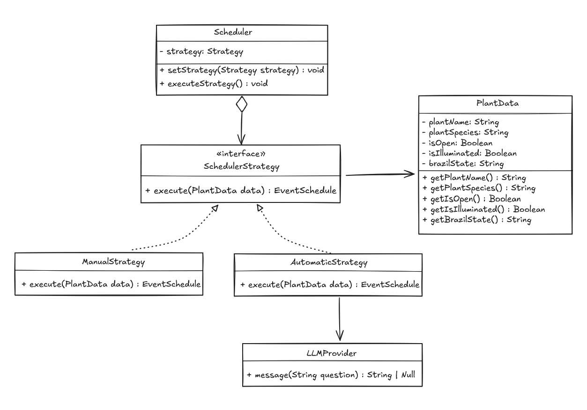

# 3.3.1. Strategy

## Introdução

O padrão Strategy é um padrão de design comportamental que permite definir uma família de algoritmos, encapsulá-los e torná-los intercambiáveis durante a execução do programa (1). Este padrão é especialmente útil quando existe a necessidade de alternar entre diferentes abordagens para resolver um mesmo problema, sem modificar o código cliente que utiliza esses algoritmos. No contexto do Plante Vc Mesmo, o Strategy se mostra fundamental para gerenciar as diferentes estratégias de cuidado que variam conforme o tipo de planta, estação do ano, condições ambientais e preferências do usuário, proporcionando flexibilidade e extensibilidade ao sistema.

## Aplicação no Projeto

O padrão de design Strategy mostrou-se uma solução eficaz para a criação do perfil de uma planta no processo de agendamento de cuidados. Esse padrão permite a implementação e aplicação dinâmica de diferentes estratégias de cuidado.

No nosso projeto, utilizamos essa abordagem para diferenciar dois modos de criação do perfil de uma planta: a criação manual e a criação automática. Dessa forma, o usuário tem a liberdade de escolher como deseja configurar o perfil da planta.

As estratégias se distinguem principalmente pelo uso de inteligência artificial na definição do período de rega. Na estratégia automática, a IA é responsável por sugerir os parâmetros ideais, enquanto na estratégia manual, o próprio usuário define esses parâmetros diretamente.

### Aprofundamento de Informações

A ideia de incluir essas informações surgiu durante uma discussão em [Pull Request](https://github.com/UnBArqDsw2025-1-Turma02/2025.1-T02-G3_PlanteVcMesmo_Entrega_03/pull/3#discussion_r2106276801) no repositório do projeto. Nessa conversa, foi levantada a necessidade de um conjunto de dados que seriam opcionais caso o usuário optasse por criar o perfil da planta manualmente. No entanto, para a criação automática, essas informações se tornaram essenciais para ajudar a definir o período ideal de rega.

Os campos foram definidos com base na experiência da equipe com cuidados de plantas, além de sugestões obtidas por meio de prompts com IA. A IA confirmou a relevância desses dados e também sugeriu outros, como o tipo de solo. No entanto, optamos por não incluir esse campo agora, para manter o aplicativo mais simples e acessível, principalmente para o público leigo.

Os campos definidos para o perfil da planta, até o momento, são:

- Nome da planta
- Nome da espécie
- Local aberto/fechado (escolha binária)
- Local iluminado/não iluminado (escolha binária)
- Estado (UF) para definição do tipo do clima do ambiente

## Vantagens e Justificativas

A adoção do padrão de projeto Strategy oferece uma vantagem significativa ao possibilitar a troca de algoritmos de forma dinâmica, durante a execução do sistema. Essa característica contribui diretamente para a flexibilidade e adaptabilidade da aplicação, permitindo a inclusão de novas estratégias de maneira simples e sem a necessidade de grandes alterações no código existente. [2]

No contexto do projeto, caso surjam novas ideias relacionadas aos cuidados com plantas, como perfis pré-definidos, elas poderão ser facilmente atendidas por meio da implementação de novas classes que sigam a interface Strategy. Assim, o sistema permanece extensível e preparado para futuras evoluções.

## Modelagem

Com base na seção Aplicação no Projeto, foi elaborada uma modelagem semelhante a um Diagrama de Classes, que servirá como protótipo para a futura implementação do sistema. Nessa modelagem, o padrão Strategy é aplicado para permitir diferentes formas de agendamento, através da interface *SchedulerStrategy* e suas implementações: *ManualStrategy* e *AutomaticStrategy*.

A classe *Scheduler* define os métodos para configurar e executar a estratégia escolhida. A classe *AutomaticStrategy* utiliza o *LLMProvider* para apoiar decisões automáticas no agendamento, baseando-se em algum sistema de IA. O provedor da IA será instanciado por meio de classes Factory, conforme o identificador do modelo utilizado. Para entender melhor a utilização do Factory no projeto, acesse: [3.1.1. Factory](./PadroesDeProjeto/GoFsCriacionais/factory.md)

<b>Autor:</b> [Mateus Vieira Rocha da Silva](https://github.com/mateusvrs), 2025 

## Referências

1. GAMMA, Erich et al. Padrões de Projeto: Soluções Reutilizáveis de Software Orientado a Objetos. Porto Alegre: Bookman, 2000. p. 292-302.
2. Refactoring Guru. Strategy Pattern. Disponível em: [https://refactoring.guru/design-patterns/strategy](https://refactoring.guru/design-patterns/strategy). Acesso em: 28 mai. 2025.

## Histórico de Versões

| Versão | Data       | Alterações Principais                             | Autor(es)        |
|--------|------------|---------------------------------------------------| ---------------- |
| 1.0.0  | 22-05-2025 | Criação do Documento do padrão de projeto Strategy| Davi Casseb      |
| 1.1.0  | 28-05-2025 | Recriação dos textos e referências                | Caio Felipe      |
