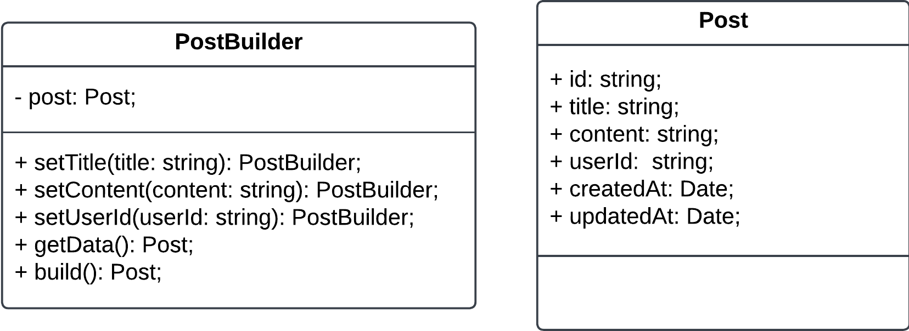
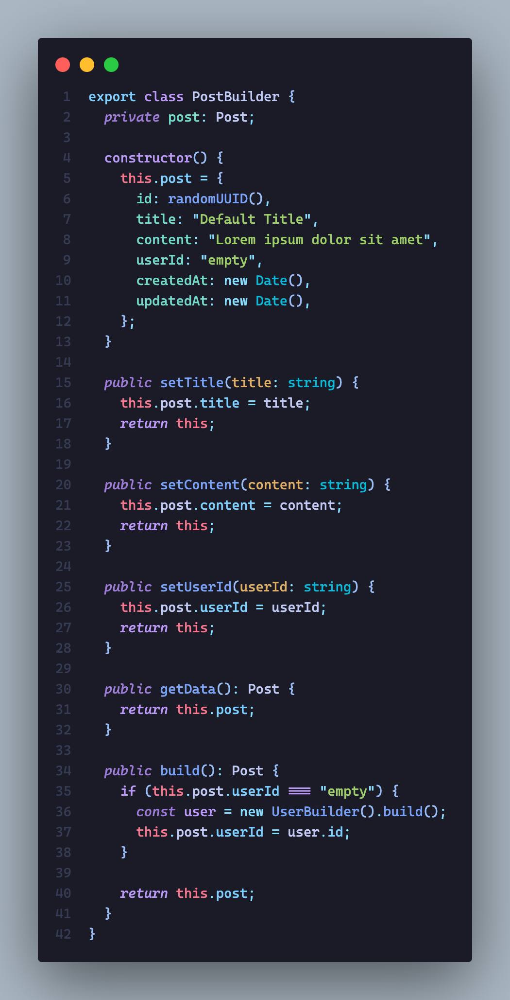
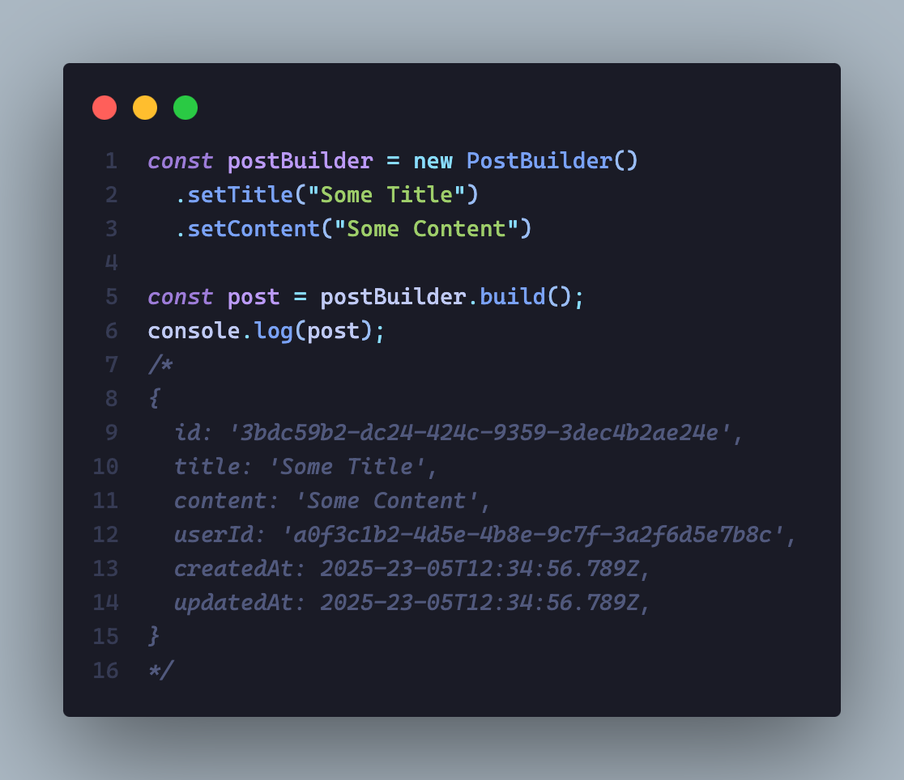

# 3.1.2. Builder

## Introdução

Builder é um padrão de projeto criacional que ajuda a construir objetos complexos de forma simplificada e organizada. Ele permite que a construção de um objeto seja dividida em etapas, onde cada etapa pode ser configurada de maneira independente. Esse padrão é especialmente útil quando o objeto a ser criado possui muitas partes ou configurações possíveis, tornando o processo de construção mais flexível e compreensível. [1]

## Vantagens e Justificativas

O uso do padrão de projeto Builder, em particular, permite que um objeto e sua representação final sejam separados em processos diferentes. Essa característica facilita a flexibilidade e a reutilização de código pois promove a construção de diferentes objetos por meio de um único processo. Além disso, os Builders melhoram a legibilidade do código, visto que cada etapa de construção é autoexplicativa e pode ser facilmente implementada, o que torna a manutenção mais ágil e o entendimento mais rápido. [2]

Em ambientes de testes automatizados, é muito comum a criação de diversos objetos que podem ter diferentes configurações.
Por isso, para o projeto o foco e a motivação em adotar o padrão Builder concentrou-se na criação de objetos durante a execução de teste. Nesse caso, o uso do padrão Builder simplifica e aumenta a declaratividade do código, reduz a repetição e diminui as chances de erro, especialmente nos casos em que muitos atributos obrigatórios precisam ser preenchidos.

Dessa forma, o padrão Builder leva a um código mais limpo e modular, o que é útil durante a manutenção e escalabilidade do sistema. Assim, desde que a estrutura encapsulada cuide da construção do objeto, mudanças podem ser feitas com impacto mínimo no resto do sistema, de forma a aumentar a velocidade no desenvolvimento e na execução dos testes, tornando o processo mais fluido.

## Modelagem

> Diagrama de classes do builder

> Exemplo do padrão Builder no projeto

> Exemplo da utilização do Builder

## Referências

1. **Builder**. Disponível em: <https://refactoring.guru/design-patterns/builder>. Acesso em: 25 maio. 2025.

2. NUZZI, **J. R. Design patterns — Parte 6 — Builder - Jones Roberto Nuzzi**. Disponível em: <https://medium.com/@jonesroberto/desing-patterns-parte-6-builder-f20752fb0c35>. Acesso em: 25 maio. 2025.

## Histórico de Versões

| Versão | Data       | Alterações Principais               | Autor(es)                      |
|:------:|:----------:|-------------------------------------| ------------------------------ |
| 0.0.1  | 24-05-2025 | Criação do documento                | Arthur Ribeiro, Pedro Henrique |