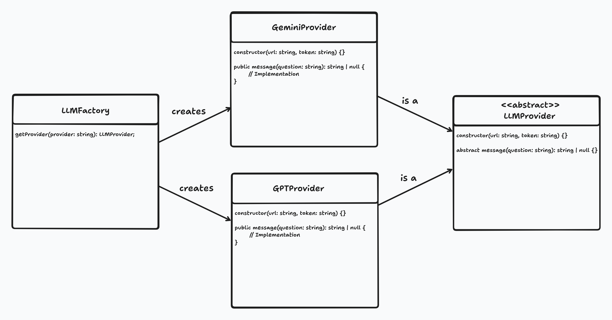

# 3.1.1. Factory

## Introdução

O método Factory é um padrão de projeto criacional que permite a criação de objetos de diferentes tipos a partir de uma `interface` ou `classe abstrata`. Seu objetivo é padronizar a utilização dos objetos, já que todos terão métodos em comum que entregam o mesmo resultado esperado, ainda que possam ter implementações internas distintas. No projeto vigente, esse design será utilizado para desacoplar os diferentes serviços de LLM, que podem ser de empresas distintas e com formas de uso não padronizadas. [1] [2].

## Aplicação no Projeto

O padrão de design Factory demonstrou ser uma solução eficaz para o chat com IA utilizado no projeto. Sua aplicação se dá na integração de diferentes modelos, como o ChatGPT e o Gemini, que exigem formas distintas de comunicação. [3] [4]. Dessa forma, o padrão permite encapsular essas variações por meio de uma interface unificada.

## Vantagens e Justificativas

A utilização do padrão de projeto Factory oferece uma vantagem significativa ao promover o desacoplamento entre o código que cria objetos e o código que os utiliza. Essa separação não só simplifica a padronização da instanciação de diferentes tipos de objetos que implementam a mesma interface ou herdam de uma classe abstrata, mas também facilita a extensibilidade. Isso significa que é possível introduzir novos tipos de produtos ou serviços dentro do mesmo contexto sem a necessidade de modificar o código cliente existente, tornando o sistema mais flexível e fácil de manter. [1].

Apesar dos benefícios evidentes em termos de padronização na criação de novos serviços, a implementação do padrão Factory pode, por vezes, introduzir uma camada adicional de complexidade na arquitetura do sistema. Essa complexidade se manifesta na adição de novas classes, subclasses e interfaces, o que pode aumentar a curva de aprendizado para desenvolvedores que estão se familiarizando com o código-base. É um trade-off a ser considerado: a flexibilidade e manutenibilidade a longo prazo em troca de uma potencial complexidade inicial. [1].

Com isso em mente, nosso principal objetivo ao aplicar o padrão Factory é estabelecer uma interface unificada para a utilização de LLMs. Essa abordagem nos permitirá, no futuro, integrar diversas APIs de LLM de diferentes provedores, garantindo que o modo de utilização permaneça consistente. Dessa forma, o código existente que já faz chamadas para o serviço de LLM não precisará ser alterado, otimizando o desenvolvimento e a manutenção, e permitindo uma fácil substituição ou adição de novos modelos de linguagem.

## Modelagem

Com base na seção Aplicação no Projeto, foi elaborada uma modelagem semelhante a um Diagrama de Classes, que servirá como protótipo para a futura implementação do sistema. Nessa modelagem, a classe abstrata *LLMProvider* define a estrutura comum que deve ser seguida pelas implementações de provedores de modelos LLM, como é o caso da classe *GeminiProvider*, representada no diagrama. Essas classes também podem ter métodos privados adicionais para uma implementação modularizada, seguindo os princípios do *Clean Code*. [5]

A responsabilidade de instanciar os provedores é da classe *LLMFactory*, que utiliza um parâmetro identificador do provedor para decidir qual implementação concreta criar. Esse identificador poderá futuramente ser representado por um Enum, contendo todas as possíveis opções de provedores suportados pela aplicação.

<b>Autor:</b> [Caio Felipe Rocha](https://github.com/caio-felipee) e [Mateus Vieira Rocha da Silva](https://github.com/mateusvrs), 2025 

## Referências

1. Refactoring Guru. Factory Method. Disponível em: [https://refactoring.guru/design-patterns/factory-method](https://refactoring.guru/design-patterns/factory-method). Acesso em: 22 mai. 2025.
2. Manik. The Factory Pattern In TypeScript. Cloudaffle. Disponível em: [https://cloudaffle.com/series/creational-design-patterns/factory-pattern/](https://cloudaffle.com/series/creational-design-patterns/factory-pattern/). Acesso em: 22 mai. 2025.
3. OpenAI. API Reference. Disponível em: [https://openai.com/api/](https://openai.com/api/). Acesso em: 22 maio 2025.
4. Google. Gemini API reference. Disponível em: [https://ai.google.dev/api?hl=pt-br&lang=python](https://ai.google.dev/api?hl=pt-br&lang=python). Acesso em: 22 maio. 2025.
5. FreeCodeCamp. How to Write Clean Code. Disponível em: [https://www.freecodecamp.org/news/how-to-write-clean-code/#heading-modularization](https://www.freecodecamp.org/news/how-to-write-clean-code/#heading-modularization). Acesso em: 24 maio 2025. 

## Histórico de Versões

| Versão | Data       | Alterações Principais                             | Autor(es)                   |
|--------|------------|---------------------------------------------------| --------------------------- |
| 0.0.1  | 22-05-2025 | Introdução                                        | Caio Felipe e Mateus Vieira |
| 0.0.2  | 22-05-2025 | Aplicação no Projeto & Vantagens e Justificativas | Caio Felipe e Mateus Vieira |
| 0.0.3  | 22-05-2025 | Imagem da Modelagem                               | Caio Felipe e Mateus Vieira |
| 0.0.4  | 24-05-2025 | Refatoração da Modelagem                          | Caio Felipe e Mateus Vieira |
| 0.1.0  | 25-05-2025 | Melhora da escrita da introdução                  | Caio Habibe e Mateus Vieira |
