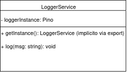
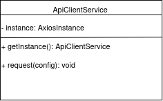

# 3.1.2. Singleton

## Introdução

O padrão Singleton é um padrão de projeto do tipo criacional que garante que uma determinada classe tenha apenas uma instância durante todo o ciclo de vida da aplicação. Essa instância é compartilhada globalmente por diversos módulos, permitindo o acesso centralizado a recursos que devem permanecer únicos [1]. Nesse projeto, esse padrão será aplicado para manter o controle e a consistência em componentes centrais tanto do backend quanto, em alguns casos, do frontend.

## Aplicação no Projeto

A aplicação do padrão Singleton no projeto “Plante Você Mesmo” é justificada pela necessidade de manter um controle centralizado e eficiente sobre recursos que devem ter apenas uma instância ativa.

No backend, será utilizado no serviço de logger, que registra informações do sistema para depuração e acompanhamento [4]. Ao utilizar uma única instância, todas as mensagens são registradas de maneira centralizada e consistente. Embora não utilize uma classe com `getInstance()`, o logger segue o padrão Singleton de forma **implícita**, ao exportar diretamente uma única instância que é reutilizada automaticamente por todos os módulos da aplicação [1].

```ts
// src/infra/logger.ts

import pino from 'pino';

const logger = pino({
  name: 'plante-vc-mesmo',
  transport: { target: 'pino-pretty' }
});

export default logger;
```

> **Nota sobre o banco de dados:** a conexão com o banco (DataSource do TypeORM) não aparece nesta modelagem, pois sua instância única já é gerenciada pela própria estrutura da **arquitetura hexagonal**, onde os componentes são organizados e compartilhados via container de injeção. Não há necessidade de aplicar um Singleton manual nesse caso [5].

No frontend, o Singleton será utilizado **somente para o cliente HTTP** da aplicação Vue.js. Isso garante que uma única instância com configurações padronizadas (como baseURL e cabeçalhos) seja utilizada em todas as requisições, evitando duplicação de código e inconsistências [2].

## Vantagens e Justificativas

A principal vantagem do Singleton é o controle centralizado sobre uma instância única de um determinado serviço. Isso é especialmente útil quando a criação de múltiplas instâncias poderia gerar inconsistências ou afetar a performance do sistema [1][3]. No caso da aplicação, garantir que o logger e o cliente HTTP sejam únicos evita duplicidade de logs e chamadas despadronizadas, além de facilitar a manutenção.

Outra vantagem relevante está na gestão de recursos. Ao manter uma única instância de serviços como o logger ou o cliente HTTP, o sistema evita a repetição de configurações e reduz o consumo de memória [2].

> **Observação importante:**  Singleton não facilita os testes automatizados. Na verdade, seu uso pode dificultar a testabilidade ao introduzir acoplamento global e dificultar a substituição por mocks [5]. Por isso, ele deve ser aplicado com cautela e preferencialmente em serviços sem estado, como o logger.

## Modelagem

Abaixo estão as modelagens dos serviços Singleton utilizados no projeto:

### LoggerService (Backend)



O `LoggerService` representa a estrutura do serviço de logging no backend. Ele possui um atributo `loggerInstance` que armazena a instância criada com a biblioteca Pino. O método `getInstance()` é simbólico, já que a instância é exportada diretamente do módulo. Toda a aplicação compartilha essa instância única para manter a coerência dos logs.

---

### ApiClientService (Frontend)



O `ApiClientService` é o serviço de requisições HTTP no frontend, baseado em uma instância configurada do Axios. Ele possui um método estático `getInstance()` que retorna essa instância, garantindo que todas as partes da aplicação usem a mesma base de configuração nas requisições.

<font size="3"><p style="text-align: center"><b>Autor:</b> Matheus Brant, 2025 </p></font>

## Referências

1. Refactoring Guru. Singleton Design Pattern. Disponível em: [https://refactoring.guru/design-patterns/singleton](https://refactoring.guru/design-patterns/singleton). Acesso em: 24 mai. 2025.  
2. Cloudaffle. Singleton Implementation. In: Creational Design Patterns Series. Disponível em: [https://cloudaffle.com/series/creational-design-patterns/singleton-design-patterns/](https://cloudaffle.com/series/creational-design-patterns/singleton-design-patterns/). Acesso em: 24 mai. 2025.  
3. Gamma, E. et al. *Design Patterns: Elements of Reusable Object-Oriented Software*. Addison-Wesley, 1994.  
4. Banda, G. *Design Patterns with TypeScript*. Leanpub, 2022.  
5. Fowler, M. *Inversion of Control Containers and the Dependency Injection pattern*. Disponível em: [https://martinfowler.com/articles/injection.html](https://martinfowler.com/articles/injection.html). Acesso em: 30 mai. 2025.

## Histórico de Versões

| Versão | Data       | Alterações Principais                             | Autor(es)                                |
|--------|------------|---------------------------------------------------|------------------------------------------|
| 0.0.1  | 22-05-2025 | Introdução                                        | Matheus Brant                            |
| 0.0.2  | 22-05-2025 | Aplicação no Projeto & Vantagens e Justificativas | Matheus Brant                            |
| 0.0.3  | 22-05-2025 | Modelagem inicial                                 | Matheus Brant                            |
| 0.0.4  | 30-05-2025 | Adaptações e Correções Necessárias para a coerência com o projeto    | Matheus Brant                            |
| 0.0.5  | 30-05-2025 | Substituição do diagrama textual por imagens UML  | Matheus Brant                            |
| 0.0.6  | 30-05-2025 | Citações numeradas das referências no texto       | Matheus Brant                            |