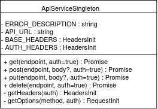

# 3.1.3. Singleton

## Introdução

O padrão Singleton é um padrão de projeto do tipo criacional que garante que uma determinada classe tenha apenas uma instância durante todo o ciclo de vida da aplicação. Essa instância é compartilhada globalmente por diversos módulos, permitindo o acesso centralizado a recursos que devem permanecer únicos [1]. Nesse projeto, esse padrão será aplicado para manter o controle e a consistência em componentes centrais tanto do backend quanto, em alguns casos, do frontend.

## Aplicação no Projeto

A aplicação do padrão Singleton no projeto “Plante Você Mesmo” é justificada pela necessidade de manter um controle centralizado e eficiente sobre recursos que devem ter apenas uma instância ativa.

No frontend, o Singleton será utilizado **somente para o cliente HTTP** da aplicação Vue.js, implementado pela classe `ApiServiceSingleton`. Essa classe encapsula os métodos `GET`, `POST`, `PUT` e `DELETE`, fornecendo uma instância única reutilizável em todo o sistema. Isso garante que todas as requisições sejam feitas com cabeçalhos padronizados e baseURL consistente, evitando duplicações e erros [2].

## Vantagens e Justificativas

A principal vantagem do Singleton é o controle centralizado sobre uma instância única de um determinado serviço. Isso é especialmente útil quando a criação de múltiplas instâncias poderia gerar inconsistências ou afetar a performance do sistema [1][3]. No caso da aplicação, garantir que o cliente HTTP seja único evita chamadas despadronizadas, além de facilitar a manutenção.

Outra vantagem relevante está na gestão de recursos. Ao manter uma única instância de serviços como o cliente HTTP, o sistema evita a repetição de configurações e reduz o consumo de memória [2].

> **Observação importante:**  Singleton não facilita os testes automatizados. Na verdade, seu uso pode dificultar a testabilidade ao introduzir acoplamento global e dificultar a substituição por mocks [5]. Por isso, ele deve ser aplicado com cautela e preferencialmente em serviços sem estado, como o logger.

## Modelagem

Abaixo está a modelagem do Singleton utilizado no projeto:

### ApiClientService (Frontend)

### ApiServiceSingleton (Frontend)

O `ApiServiceSingleton` é o serviço de requisições HTTP no frontend, responsável por centralizar todas as chamadas para a API. Ele encapsula os métodos `GET`, `POST`, `PUT` e `DELETE`, cada um com lógica interna para configurar cabeçalhos, tratamento de erros e controle de autenticação. Não utiliza o método `getInstance()`, pois a instância já é criada e exportada diretamente, seguindo o padrão Singleton de forma implícita.

> Para ver a implementação da classe, acesse o repositório:  
> [ApiService.ts](https://github.com/UnBArqDsw2025-1-Turma02/2025.1-T02-G3_PlanteVcMesmo_Entrega_03/blob/dev/frontend/src/api/ApiService.ts)

<b>Autor:</b> Matheus Brant, 2025 

## Referências

1. Refactoring Guru. Singleton Design Pattern. Disponível em: [https://refactoring.guru/design-patterns/singleton](https://refactoring.guru/design-patterns/singleton). Acesso em: 24 mai. 2025.  
2. Cloudaffle. Singleton Implementation. In: Creational Design Patterns Series. Disponível em: [https://cloudaffle.com/series/creational-design-patterns/singleton-design-patterns/](https://cloudaffle.com/series/creational-design-patterns/singleton-design-patterns/). Acesso em: 24 mai. 2025.  
3. Gamma, E. et al. *Design Patterns: Elements of Reusable Object-Oriented Software*. Addison-Wesley, 1994.  
4. Banda, G. *Design Patterns with TypeScript*. Leanpub, 2022.  
5. Fowler, M. *Inversion of Control Containers and the Dependency Injection pattern*. Disponível em: [https://martinfowler.com/articles/injection.html](https://martinfowler.com/articles/injection.html). Acesso em: 30 mai. 2025.

## Histórico de Versões

| Versão | Data       | Alterações Principais                             | Autor(es)                                |
|--------|------------|---------------------------------------------------|------------------------------------------|
| 0.0.1  | 22-05-2025 | Introdução                                        | Matheus Brant                            |
| 0.0.2  | 22-05-2025 | Aplicação no Projeto & Vantagens e Justificativas | Matheus Brant                            |
| 0.0.3  | 22-05-2025 | Modelagem inicial                                 | Matheus Brant                            |
| 0.0.4  | 30-05-2025 | Adaptações e Correções Necessárias para a coerência com o projeto    | Matheus Brant                            |
| 0.0.5  | 30-05-2025 | Substituição do diagrama textual por imagens UML  | Matheus Brant                            |
| 0.0.6  | 30-05-2025 | Citações numeradas das referências no texto       | Matheus Brant                            |
| 0.0.7  | 30-05-2025 | Ajustes na documentação do ApiService             | Matheus Brant                            |