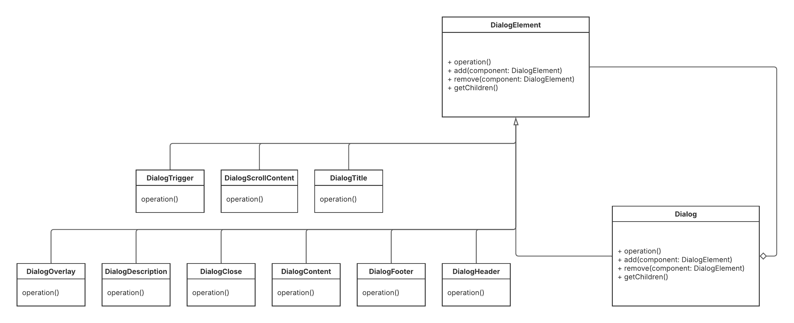
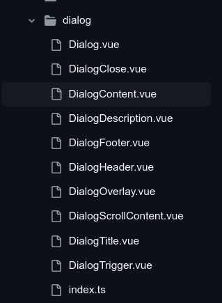

# 3.2.1. Composite

<!-- COLOQUE AS REFERÊNCIAS POR PARÁGRAFO ESCRITO, PODE ENUMERAR E COLOCAR POR NÚMERO, TIPO EM ARTIGO MSM -->

<!-- ESCREVA PELO MENOS 3 PARÁGRAFOS DE CADA TÓPICO, CADA UM COM NO MíNIMO 70 PALAVRAS -->

<!-- NÂO SE LIMITE A ESSES TÓPICOS, MAS MANTENHA A ORDEM RELATIVA -->

## Introdução

O Padrão de Projeto Composite visa organizar as estruturas de um projeto, tendo como objetivo agrupar objetos de uma relação parte-todo afim de que sejam tratados de maneira uniforme, ou seja, sem distinção.Este padrão é utilizado neste projeto para facilitar a componentização de elementos na interface do usuário. Ele permite que componentes sejam divididos em subpartes menores, promovendo a reutilização e a organização do código. Por exemplo, no contexto deste projeto, botões, formulários e outros elementos da interface são implementados como componentes independentes que podem ser compostos para formar estruturas mais complexas, da mesma forma que subcomponentes são utilizados para estruturar um componente maior.    

## Vantagens e Justificativas

O uso do Padrão Composite no projeto traz diversas vantagens que justificam sua aplicação. Primeiramente, ele promove a modularidade, permitindo que cada subcomponente seja desenvolvido e testado de forma isolada. Isso simplifica a manutenção e a evolução do sistema, pois alterações em um subcomponente não afetam diretamente os demais, reduzindo o risco de introdução de erros.

Além disso, a reutilização de componentes é significativamente facilitada. Subpartes de um componente podem ser reaproveitadas em diferentes contextos, otimizando o tempo de desenvolvimento e garantindo consistência na interface do usuário.

Por fim, a coesão é aprimorada, uma vez que o Composite incentiva a organização lógica e hierárquica dos elementos. Isso resulta em um código mais limpo e legível o que contribui para posteriores alterações.

## Modelagem

Concretizando este contexto de uso numa representação UML, teríamos, por exemplo, uma classe abstrata 'DialogElement', as Leafs: DialogClose, DialogContent, DialogDescription, DialogFooter, DialogHeader, DialogOverlay, DialogScrollContent, DialogTitle, DialogTrigger e por fim o Composite: Dialog. Cada Leaf representa uma parte específica do Dialog, enquanto o Composite agrega essas partes para formar um Dialog completo. Essa estrutura permite que o componente seja tratado como uma única entidade, simplificando a manipulação e a renderização na interface do usuário.

Esboço UML:


## Implementação
A implementação do Composite é feita em diversos componentes do projeto, seguindo um padrão estrutural como no exemplo a seguir:

```vue
<Form>
    <FormHeader>
        <FormField />
    </FormHeader>
</Form>
```
Com isso, o projeto segue este padrão organizacional com todos os componentes, permitindo uma melhor manutenção e legibilidade do código. A imagem a seguir ilustra a implementação do exemplo Dialog citado anteriormente:

[](https://github.com/UnBArqDsw2025-1-Turma02/2025.1-T02-G3_PlanteVcMesmo_Entrega_03/tree/dev/frontend/src/components/ui/dialog)

## Referências

1. LUQUE, LEANDRO; SILVA, RODRIGO ROCHA. *Builder e Composite: padrões para a sua caixa de ferramentas*. 2014.
2. ROBERTO, Jones. Desing Patterns: Parte 10 — Composite. Medium, 11 out. 2017. Disponível em: <https://medium.com/@jonesroberto/desing-patterns-parte-10-composite-f7600cb3aad7>. Acesso em: 22 maio 2025.
3. Materiais de Aula - Arquitetura e Desenho de Software - 2025.1 - UnB


## Histórico de Versões

| Versão | Data       | Alterações Principais                             | Autor(es)        |
|--------|------------|---------------------------------------------------| ---------------- |
| 0.0.1  | 24-05-2025 | Adição do Padrão Composite na Docmentação         | Caio Magalhães Lamego            |