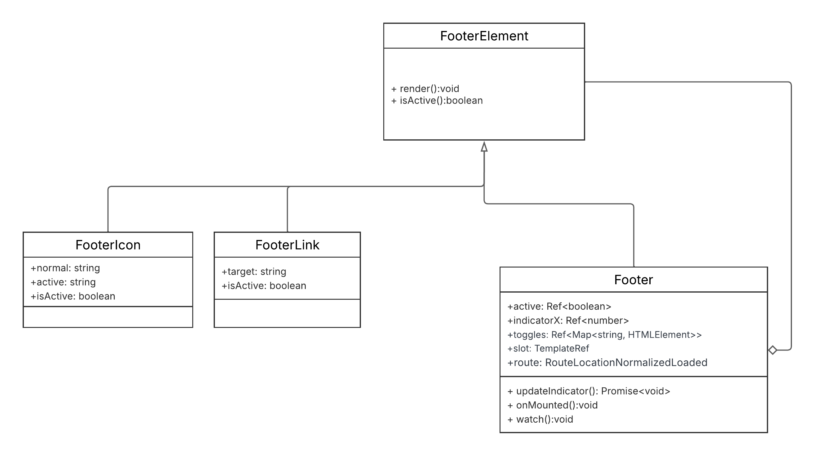

# 3.2.1. Composite


## Introdução

O Padrão de Projeto Composite visa organizar as estruturas de um projeto, tendo como objetivo agrupar objetos de uma relação parte-todo afim de que sejam tratados de maneira uniforme, ou seja, sem distinção [2]. Este padrão é utilizado neste projeto para facilitar a componentização de elementos na interface do usuário. Ele permite que componentes sejam divididos em subpartes menores, promovendo a reutilização e a organização do código [1]. Por exemplo, no contexto deste projeto, botões, formulários e outros elementos da interface são implementados como componentes independentes que podem ser compostos para formar estruturas mais complexas, da mesma forma que subcomponentes são utilizados para estruturar um componente maior.    

## Vantagens e Justificativas

O uso do Padrão Composite no projeto traz diversas vantagens que justificam sua aplicação. Primeiramente, ele promove a modularidade, permitindo que cada subcomponente seja desenvolvido e testado de forma isolada. Isso simplifica a manutenção e a evolução do sistema, pois alterações em um subcomponente não afetam diretamente os demais, reduzindo o risco de introdução de erros [2].

Além disso, a reutilização de componentes é significativamente facilitada. Subpartes de um componente podem ser reaproveitadas em diferentes contextos, otimizando o tempo de desenvolvimento e garantindo consistência na interface do usuário.

Por fim, a coesão é aprimorada, uma vez que o Composite incentiva a organização lógica e hierárquica dos elementos. Isso resulta em um código mais limpo e legível o que contribui para posteriores alterações.

## Discussões da equipe

Diante do entendimento do Padrão Composite, ficou sob critério da equipe a decisão de onde e como seria aplicado no projeto. O Composite é usado principalmente na parte de Backend, onde a estrutura é organizada em uma hierarquia de classes, permitindo que objetos sejam tratados de forma uniforme. Entretanto, o fato de prevalecer no Backend não impede que seja utilizado no Frontend, onde a estrutura de componentes Vue é organizada de forma que um componente é "dividido em subpartes", permitindo que cada parte seja tratada como um componente independente, mas que, quando unidas, formam um componente maior e mais complexo.

Também discutiu-se a possibilidade de aplicar o Composite na parte de filtros de pesquisa na aba de Shopping, onde cada produto em específico seria tratado como uma leaf, ao passo que quando agrupados, formariam um Composite que representa uma coleção de produtos, por exemplo: os produtos Girassol, Rosa, Orquídea, Lírio, etc seriam leafs e quando agrupados formariam o Composite Flores, que seria um dos filtros possíveis. No entanto, essa abordagem foi considerada mais complexa do que o necessário para o escopo atual do projeto e, apesar de possuir um conceito parecido, ficou entendido que não se tratava de um Padrão de Design Composite, de fato, por não ter nenhum impacto estruturalmente no projeto.

Com isso, definiu-se que a melhor aplicação do Composite seria, realmente, na parte de Frontend, permitindo que componentes (Composite) sejam compostos de subcomponentes (leafs).

## Modelagem

Diante deste contexto de uso tem-se, por exemplo, analogamente ao UML: uma classe abstrata 'FooterElement', as Leafs: FooterLink e FooterIcon e por fim o Composite: Footer. Cada Leaf representa uma parte específica do componente, enquanto o Composite agrega essas partes para formar um Footer completo [1]. É importante ressaltar que o Composite pode ser formado por qualquer combinação das leafs. Essa estrutura permite que o componente seja tratado como uma única entidade, simplificando a manipulação e a renderização na interface do usuário.

Esboço:


<font size="3"><p style="text-align: center"><b>Autor:</b> [Caio Magalhães Lamego](https://github.com/caiolamego), 2025 </p></font>

## Implementação
A implementação do Composite é feita em diversos componentes do projeto, seguindo um padrão estrutural como no exemplo a seguir:

```vue
<Footer>
    <FooterLink>
        <FooterIcon />
    </FooterLink>
</Footer>
```
Com isso, o projeto segue este padrão organizacional com todos os componentes, permitindo uma melhor manutenção e legibilidade do código. A imagem a seguir ilustra a estrutura do exemplo Footer citado anteriormente:

[](https://github.com/UnBArqDsw2025-1-Turma02/2025.1-T02-G3_PlanteVcMesmo_Entrega_03/blob/dev/frontend/src/layouts/AppLayout.vue)

Sendo aplicado desta maneira:

```vue
 <div
      class='grid grid-rows-10 h-screen'
  >
    <slot />
    <Footer>
      <FooterLink target='about'>
        <FooterIcon
          normal='fluent:home-12-regular'
          active='fluent:home-12-filled'
        />
      </FooterLink>
      <FooterLink target='shopping'>
        <FooterIcon
          normal='solar:bag-4-outline'
          active='solar:bag-4-bold'
        />
      </FooterLink>
      <FooterLink target='news'>
        <FooterIcon
          normal='majesticons:note-text-line'
          active='majesticons:note-text'
        />
      </FooterLink>
    </Footer>
  </div>
```
O commit completo desta implementação pode ser encontrado aqui: [AppLayout.vue](https://github.com/UnBArqDsw2025-1-Turma02/2025.1-T02-G3_PlanteVcMesmo_Entrega_03/commit/304e3f4f1087c6e578c69702039e3648be0f9591)

## Modelagem
Diante deste contexto de uso tem-se, por exemplo, analogamente ao UML: uma classe abstrata PostDisplayElement, as Leafs: PostHeaderDisplay (responsável por exibir título, autor e metadados), PostContentDisplay (apresentando o corpo principal da publicação, como texto e mídias) e PostInteractionControls (agrupando elementos de engajamento como botões de curtir, comentar e compartilhar), e por fim o Composite: PostView. Cada Leaf representa uma seção visual e funcional distinta da publicação, enquanto o Composite PostView agrega essas seções para formar a apresentação completa de uma publicação na interface [1]. É importante ressaltar que o PostView é formado pela combinação dessas Leafs, o que permite variações na apresentação e inclusão seletiva de funcionalidades conforme o contexto. Essa estrutura permite que a visualização da publicação (PostView) seja tratada como uma única entidade, simplificando sua construção, manipulação pela lógica da interface e a aplicação de atualizações visuais ou comportamentais de forma coesa.

Esboço:


<font size="3"><p style="text-align: center"><b>Autor:</b> [Rafael Melo Matuda](https://github.com/rmatuda), 2025 </p></font>

## Implementação
A implementação do Composite é feita em diversos componentes do projeto, seguindo um padrão estrutural como no exemplo a seguir:
```ts
<Post>
  <PostHeader>

    <PostLabelGroup>
      <PostLabel />
    </PostLabelGroup>
  </PostHeader>
  <PostText>

  </PostText>
</Post>
```
Com isso, o projeto segue este padrão organizacional com todos os componentes, permitindo uma melhor manutenção e legibilidade do código. A imagem a seguir ilustra a estrutura do exemplo Footer citado anteriormente:

[]
(link do commit)

Sendo aplicado desta maneira:
```ts
<template>
  <Post>
    <template v-slot:header>
      <PostHeader
        :title="post?.title"
        :labels="post?.labels"
      >
        <PostLabelGroup>
          <PostLabel
            v-for="(label, index_label) in post?.labels"
            :key="index_label"
            :label="label"
          />
        </PostLabelGroup>
      </PostHeader>
    </template>
    <template v-slot:main>
      <PostText>
        {{ post?.description }}
      </PostText>
    </template>
  </Post>
</template>
```

## Referências

1. LUQUE, LEANDRO; SILVA, RODRIGO ROCHA. *Builder e Composite: padrões para a sua caixa de ferramentas*. 2014.
2. ROBERTO, Jones. Desing Patterns: Parte 10 — Composite. Medium, 11 out. 2017. Disponível em: <https://medium.com/@jonesroberto/desing-patterns-parte-10-composite-f7600cb3aad7>. Acesso em: 22 maio 2025.
3. Materiais de Aula - Arquitetura e Desenho de Software - 2025.1 - UnB


## Histórico de Versões

| Versão | Data       | Alterações Principais                             | Autor(es)        |
|--------|------------|---------------------------------------------------| ---------------- |
| 0.0.1  | 24-05-2025 | Adição do Padrão Composite na Docmentação         | Caio Magalhães Lamego
| 0.0.2  | 30-05-2025 | Revisão e detalhamento na documentação do Composite   | Caio Magalhães Lamego |
| 0.0.3  | 01-06-2025 | Detalhamento na documentação do Composite (Post)  | Rafael Melo Matuda |