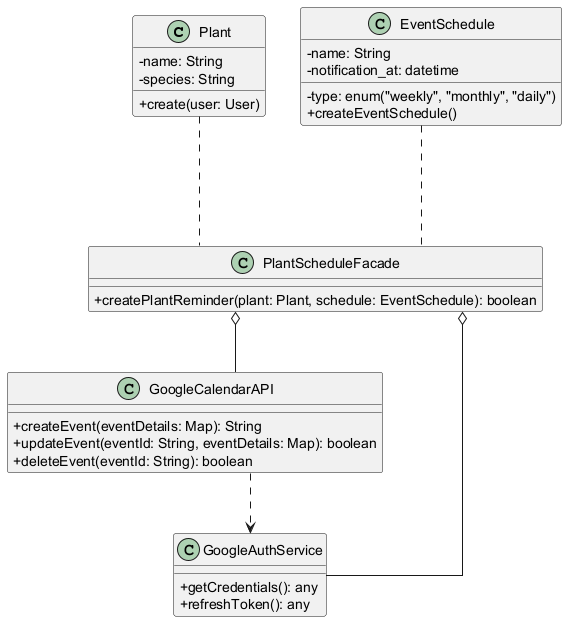
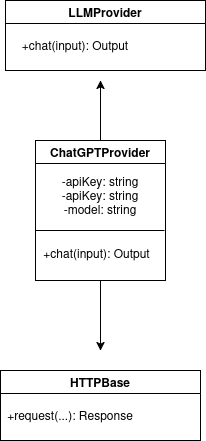
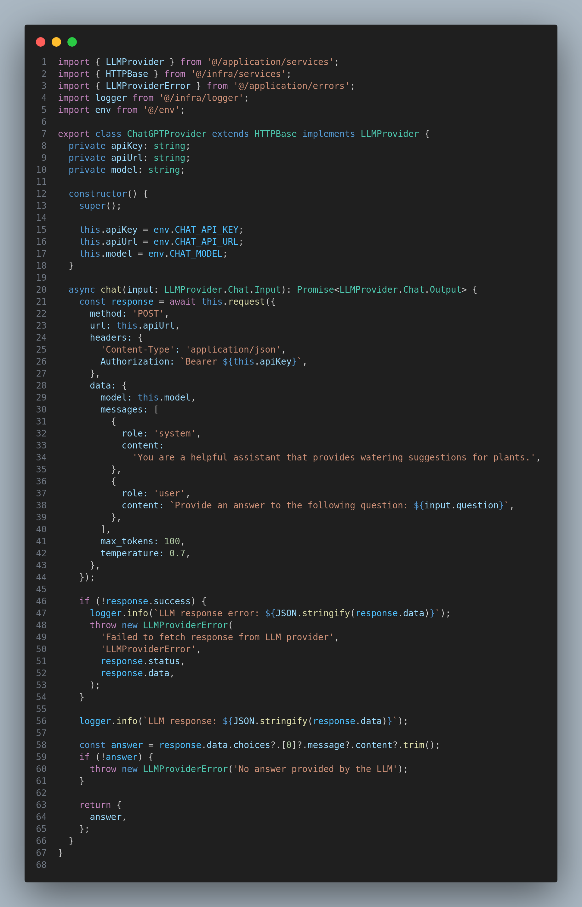

# 3.2.2. Facade

## Introdução

O padrão de projeto <i>Facade</i> é um dos padrões estruturais descritos no livro <i>"Design Patterns: Elements of Reusable Object-Oriented Software"<a href="https://unbarqdsw2025-1-turma02.github.io/2025.1-T02-G3_PlanteVcMesmo_Entrega_03/#/PadroesDeProjeto/3.2.2.Facade?id=referências"><b>1</b></a></i> dos autores conhecidos como <i>Gang of Four (GoF)</i>. Sua principal função é fornecer uma comunicação simplificada entre um componente e um conjunto de interfaces de um subsistema complexo<a href="https://unbarqdsw2025-1-turma02.github.io/2025.1-T02-G3_PlanteVcMesmo_Entrega_03/#/PadroesDeProjeto/3.2.2.Facade?id=referências"><b>2</b></a>, tornando-o mais fácil de usar e entender. Ao encapsular as complexidades internas desse subsistema, o <i>Facade</i> permite que os clientes interajam com o sistema de forma mais intuitiva, com uma só fachada (ou conjunto de fachadas) que delegam as chamadas para os métodos necessários, retirando a a necessidade de conhecer os detalhes internos de sua implementação<a href="https://unbarqdsw2025-1-turma02.github.io/2025.1-T02-G3_PlanteVcMesmo_Entrega_03/#/PadroesDeProjeto/3.2.2.Facade?id=referências"><b>3</b></a>.

## Vantagens e Justificativas

 
    O uso do <i>Facade</i> no nosso projeto oferece vantagens significativas considerando a arquitetura modular e a interação com serviços externos. Primeiramente, ele simplifica a interface de subsistemas como a interação com o <i>Google Cloud</i> (uso do Calendar, Shopping e Gmail) e a API da GeminiAI. Em vez de ter que lidar com múltiplas classes e chamadas de API para cada serviço, podemos ter, sedundo Gamma et al. (1994, p. 185)<a href="https://unbarqdsw2025-1-turma02.github.io/2025.1-T02-G3_PlanteVcMesmo_Entrega_03/#/PadroesDeProjeto/3.2.2.Facade?id=referências"><b>1</b></a>, classes <i>Facade</i> que pode fornecer métodos que abstraem essa complexidade, tornando o uso desses serviços mais direto e simples para os demais módulos do sistema.   
    Em segundo lugar, o <i>Facade</i> reduz o acoplamento entre os módulos do sistema e os subsistemas externos ou internos. Quando um módulo como Plant precisa agendar um lembrete no <i>Google Calendar</i>, ele não precisa saber os detalhes de autenticação ou formatação de dados da API do Google. Ele simplesmente invoca um método na fachada correspondente, que se encarrega de toda a orquestração. Essa desassociação é benéfica para a manutenibilidade do sistema, pois mudanças em uma API externa ou na estrutura interna de um subsistema não exigirão uma reescrita completa do código que o utiliza, apenas de parte da respectiva <i>Facade</i><a href="https://unbarqdsw2025-1-turma02.github.io/2025.1-T02-G3_PlanteVcMesmo_Entrega_03/#/PadroesDeProjeto/3.2.2.Facade?id=referências"><b>2</b></a>. 

    

Além disso, aplicamos o padrão <i>Facade</i> na integração com o serviço de modelo de linguagem (LLM) por meio da classe <code>ChatGPTProvider</code>. Esta classe encapsula todos os detalhes técnicos da comunicação com a API externa do ChatGPT, como headers, corpo da requisição, tratamento de erros e autenticação. Com isso, os módulos da aplicação que desejam consumir esse serviço precisam apenas fornecer uma pergunta e receber uma resposta, sem se preocupar com os detalhes internos da API<a href="#ref3"><b>3</b></a>. Essa abordagem promove reutilização, clareza e facilidade de manutenção do sistema.

## Cuidados
    

 Apesar dos benefícios, o <i>Facade</i> pode introduzir desvantagens dependendo da nossa implementação e evolução do código. Uma <i>Facade</i> "deus"<a href="https://unbarqdsw2025-1-turma02.github.io/2025.1-T02-G3_PlanteVcMesmo_Entrega_03/#/PadroesDeProjeto/3.2.2.Facade?id=referências"><b>2</b></a> (que agrupa muitas responsabilidades) pode se tornar um ponto de falha e aumentar a complexidade do código, indo de encontro ao principal propósito deste <i>design pattern</i>, que é a simplificação. Para mitigar esse problema, podemos adotar o conceito de Martin (2003, p.95)<a href="https://unbarqdsw2025-1-turma02.github.io/2025.1-T02-G3_PlanteVcMesmo_Entrega_03/#/PadroesDeProjeto/3.2.2.Facade?id=referências"><b>3</b></a> que é o "Princípio de Responsabilidade Única (SRP)", para que quando essas responsabilidades comecem a crescer uma classe auxiliar ou até mesmo outra <i>facade</i> seja criada. 

Caso o escopo do nosso projeto aumente e tenhamos um outro "cliente" interessado em acessar classes da nossa <i>facade</i> pode ser vantajoso, de acordo com Gamma et al. (1994, p. 188)<a href="https://unbarqdsw2025-1-turma02.github.io/2025.1-T02-G3_PlanteVcMesmo_Entrega_03/#/PadroesDeProjeto/3.2.2.Facade?id=referências"><b>1</b></a>,  ter uma estratégia bem definida de encapsulamento de classes, em que podemos ter, por exemplo, classes públicas dentro do subsistema da nossa <i>facade</i>, permitindo que métodos bem definidos sejam utilizados por classes externas.

## Modelagem

<b>Figura 1:</b> Rascunho do <i>Facade</i>

<b>Autores:</b> [Gabriel Fernando De Jesus Silva][MMcLovin], 2025

Na Figura 1 temos a modelagem do padrão, com a <code><b>PlantScheduleFacade</b></code> sendo a ligação para um subsistema. Ela permite que a aplicação crie lembretes de plantas <code><b>createPlantReminder</b></code> abstraindo as operações de autenticação e interação com a GoogleCalendarAPI.

A função principal do <code><b>PlantScheduleFacade</b></code> é, uma vez passados os parâmetros <code><b>Plant</b></code> e <code><b>EventSchedule</b></code>, ocultar os processos de gerenciar credenciais via <code><b>GoogleAuthService</code></b> para poder manipular eventos com o <code><b>GoogleCalendarAPI</code></b>, como criar, atualizar ou deletar, desvinculando do "cliente" os detalhes de baixo nível dessas APIs e tornando o sistema mais limpo e fácil de usar.

De forma análoga, o <code><b>ChatGPTProvider</b></code> pode ser modelado como uma fachada para o subsistema de comunicação com modelos de linguagem. Ele implementa a interface <code>LLMProvider</code>, expondo apenas o método <code>chat</code>, enquanto oculta as chamadas HTTP, o manuseio de erros e a formatação das mensagens. Essa arquitetura permite que o sistema envie perguntas e receba respostas de forma eficiente e desacoplada da tecnologia subjacente<a href="#ref3"><b>3</b></a>.

Contudo, embora a modelagem apresentada contemple a utilização da <code><b>GoogleCalendarAPI</b></code> e do serviço de autenticação <code><b>GoogleAuthService</b></code>, a funcionalidade específica de integração com o Google Calendar ainda não foi implementada. Isso ocorreu devido à limitação de tempo e à pouca familiaridade da equipe com os processos de autenticação e consumo da API do Google. Ainda assim, o restante da estrutura do padrão Facade está em uso, garantindo a organização do sistema e facilitando uma futura expansão para incluir essa funcionalidade.

<b>Figura 2:</b> Aplicação do padrão Facade para provedor LLM

<b>Autores:</b> [Matheus Brant][MatheussBrant], 2025

## Implementação

O código mostra a implementação da classe <code>ChatGPTProvider</code>, que atua como uma fachada para encapsular toda a complexidade da integração com a API de um modelo de linguagem natural. Essa classe estende <code>HTTPBase</code>, herdando funcionalidades genéricas de requisição HTTP, e implementa a interface <code>LLMProvider</code>, garantindo que siga um contrato comum com outros possíveis provedores. Através do método <code>chat</code>, ela oferece uma única porta de entrada para o consumo do serviço de IA, ocultando detalhes como headers de autenticação, estrutura da requisição e tratamento de erros. Com isso, os módulos da aplicação que precisam utilizar esse serviço lidam apenas com uma interface simples e de alto nível, representando fielmente o padrão <i>Facade</i>.

## Referências

1. Gamma, E., Helm, R., Johnson, R., & Vlissides, J. (1994). Design Patterns: Elements of Reusable Object-Oriented Software. Addison-Wesley. Disponível em: https://www.javier8a.com/itc/bd1/articulo.pdf
2. Refactoring.Guru. Facade. Disponível em: https://refactoring.guru/design-patterns/facade
3. Cloudaffle. Introduction to Facade Pattern. Disponível em: https://cloudaffle.com/series/structural-design-patterns/facade-pattern-classic-implementation/
4.  Martin, Robert C. (2003). Agile Software Development, Principles, Patterns, and Practices. Prentice Hall. p. 95. Disponível em: https://dl.ebooksworld.ir/motoman/Pearson.Agile.Software.Development.Principles.Patterns.and.Practices.www.EBooksWorld.ir.pdf

## Histórico de Versões

| Versão | Data       | Alterações Principais                             | Autor(es)        |
|--------|------------|---------------------------------------------------| ---------------- |
| 1.0.0  | 22-05-2025 | Criação do documento e seções iniciais            | [Gabriel Fernando de Jesus Silva][MMcLovin] |
| 1.0.1  | 01-06-2025 | Adição da implementação do facade no ChatProvider            | [Matheus Brant][MatheussBrant] |
| 1.0.2  | 01-06-2025 | Adição na modelagem do Facade, limitações na integração com Google Calendar| [Pedro Henrique][PedroHenrique061] |

[artrsousa1]: https://github.com/artrsousa1  
[CaioHabibe]: https://github.com/CaioHabibe  
[caio-felipee]: https://github.com/caio-felipee  
[caiolamego]: https://github.com/caiolamego  
[dcasseb]: https://github.com/dcasseb  
[MMcLovin]: https://github.com/MMcLovin  
[mateusvrs]: https://github.com/mateusvrs  
[MatheussBrant]: https://github.com/MatheussBrant  
[PedroHenrique061]: https://github.com/PedroHenrique061  
[rmatuda]: https://github.com/rmatuda
