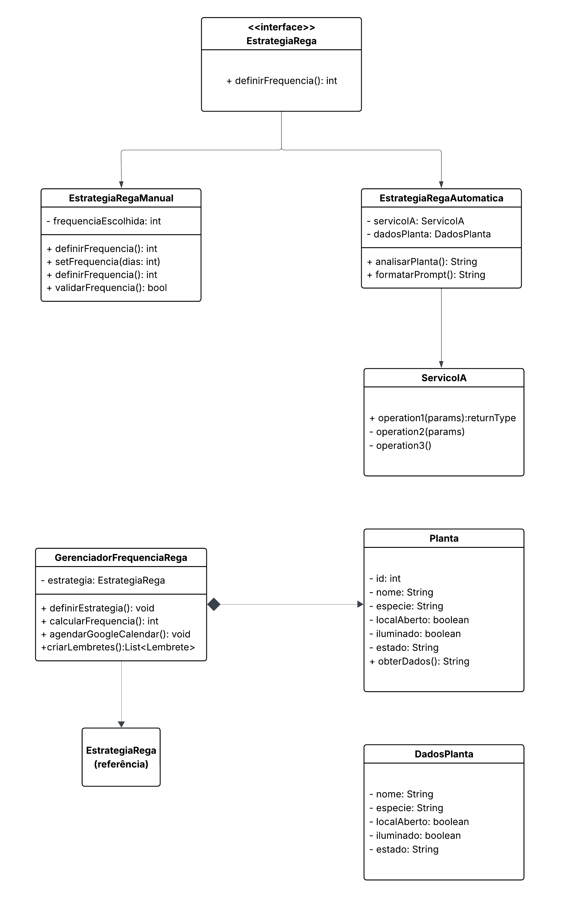

# 3.3.1. Strategy

<!-- COLOQUE AS REFERÊNCIAS POR PARÁGRAFO ESCRITO, PODE ENUMERAR E COLOCAR POR NÚMERO, COMO SE FOSSE UM ARTIGO MESMO -->

<!-- ESCREVA PELO MENOS 3 PARÁGRAFOS DE CADA TÓPICO, CADA UM COM NO MíNIMO 70 PALAVRAS -->

<!-- NÂO SE LIMITE A ESSES TÓPICOS, MAS MANTENHA A ORDEM RELATIVA -->

## Introdução

O padrão Strategy é um padrão de design comportamental que permite definir uma família de algoritmos, encapsulá-los e torná-los intercambiáveis durante a execução do programa (1). Este padrão é especialmente útil quando existe a necessidade de alternar entre diferentes abordagens para resolver um mesmo problema, sem modificar o código cliente que utiliza esses algoritmos. No contexto do web app de cuidados com plantas, o Strategy se mostra fundamental para gerenciar as diferentes estratégias de definição de frequência de rega, oferecendo ao usuário a flexibilidade de escolher entre uma abordagem manual personalizada ou uma abordagem automática baseada em inteligência artificial, proporcionando simplicidade e adaptabilidade ao sistema.

## Vantagens e Justificativas

A implementação do padrão Strategy no web app de cuidados com plantas oferece benefícios significativos para a flexibilidade e usabilidade do sistema (2). Primeiramente, o padrão permite que usuários com diferentes níveis de experiência em jardinagem utilizem a aplicação de forma efetiva. Usuários experientes podem optar pela estratégia manual, definindo suas próprias frequências de rega baseadas em seu conhecimento e experiência pessoal, enquanto iniciantes podem se beneficiar da estratégia automática, que utiliza inteligência artificial para determinar a melhor frequência considerando fatores ambientais e características específicas da planta.

A flexibilidade proporcionada pelo Strategy é particularmente valiosa para atender às necessidades diversificadas dos usuários da plataforma (3). A estratégia manual oferece controle total sobre a frequência de rega, permitindo que o usuário defina intervalos específicos como diário, semanal ou mensal, adaptando-se perfeitamente às rotinas pessoais e preferências individuais. Essa abordagem reconhece que muitos usuários preferem manter controle direto sobre seus cuidados com plantas, especialmente aqueles que já possuem experiência ou rotinas estabelecidas de jardinagem.

Além disso, a estratégia automática democratiza o acesso ao conhecimento especializado em jardinagem através da integração com modelos de linguagem grande (LLM) (4). Esta abordagem coleta informações essenciais como nome da planta, espécie, localização (aberta/fechada), iluminação (iluminado/não iluminado) e estado (UF) para determinar o clima regional, fornecendo esses dados para a IA que analisa e retorna a frequência de rega mais adequada. Essa estratégia elimina a barreira de conhecimento técnico, permitindo que usuários sem experiência em jardinagem obtenham recomendações personalizadas e baseadas em dados científicos, aumentando significativamente as chances de sucesso no cuidado com suas plantas.

## Modelagem

A modelagem do padrão Strategy para o sistema de definição de frequência de rega segue uma estrutura simplificada e focada, adaptada às necessidades específicas do projeto (5). A interface EstrategiaRega define o contrato comum que ambas as estratégias devem implementar, estabelecendo o método fundamental definirFrequencia() que retorna a frequência de rega em dias. Esta interface garante que tanto a abordagem manual quanto a automática forneçam o resultado necessário para programar os lembretes no Google Agenda de forma consistente.

As duas implementações concretas da estratégia representam as diferentes abordagens de definição da frequência de rega (6). A EstrategiaRegaManual permite que o usuário defina diretamente a frequência desejada através de uma interface simples, onde pode especificar intervalos como 1 dia (diário), 3 dias, 7 dias (semanal), ou qualquer outro intervalo personalizado. Esta estratégia simplesmente retorna o valor definido pelo usuário, proporcionando controle total sobre o agendamento dos cuidados. A implementação inclui validações básicas para garantir que a frequência informada seja um valor positivo e razoável.

A EstrategiaRegaAutomatica implementa uma abordagem mais sofisticada que integra com serviços de inteligência artificial (7). Esta estratégia coleta informações detalhadas sobre a planta através de um formulário estruturado, incluindo nome da planta, espécie, se está localizada em ambiente aberto ou fechado, nível de iluminação do local e o estado (UF) onde a planta se encontra para determinação das condições climáticas regionais. Esses dados são formatados e enviados para um modelo LLM através do ServicoIA, que analisa as informações e retorna uma recomendação de frequência de rega baseada em conhecimento botânico especializado. A estratégia processa a resposta da IA e converte para um valor numérico em dias que será utilizado pelo sistema de agendamento.

A implementação prática do padrão Strategy no web app demonstra como duas abordagens fundamentalmente diferentes podem coexistir harmoniosamente no mesmo sistema (8). Quando um usuário experiente seleciona a estratégia manual, o sistema apresenta uma interface simples onde pode definir a frequência desejada, como "regar a cada 3 dias" ou "regar semanalmente". Essa escolha é imediatamente processada e os lembretes são criados no Google Agenda conforme a frequência especificada. Para usuários que optam pela estratégia automática, o sistema coleta as informações essenciais da planta e do ambiente, envia esses dados para o modelo LLM que pode responder algo como "Para uma Espada-de-São-Jorge em ambiente interno bem iluminado no estado de São Paulo, recomenda-se regar a cada 7-10 dias", e o sistema processa essa resposta para agendar os lembretes automaticamente. Esta flexibilidade permite que a aplicação atenda tanto usuários que preferem controle direto quanto aqueles que desejam orientação especializada automatizada.

## Referências

- (1) GAMMA, Erich et al. Padrões de Projeto: Soluções Reutilizáveis de Software Orientado a Objetos. Porto Alegre: Bookman, 2000. p. 292-302.
- (2) FREEMAN, Eric; ROBSON, Elisabeth. Use a Cabeça! Padrões de Projetos. 2. ed. São Paulo: Alta Books, 2007. p. 24-45.
- (3) MARTIN, Robert C. Arquitetura Limpa: O Guia do Artesão para Estrutura e Design de Software. São Paulo: Alta Books, 2019. p. 156-167.
- (4) MARTIN, Robert C. Princípios, Padrões e Práticas Ágeis em C#. Porto Alegre: Bookman, 2011. p. 142-158.
- (5) LARMAN, Craig. Utilizando UML e Padrões: Uma Introdução à Análise e ao Projeto Orientados a Objetos e ao Desenvolvimento Iterativo. 3. ed. Porto Alegre: Bookman, 2007. p. 387-401.
- (6) FOWLER, Martin. Padrões de Arquitetura de Aplicações Corporativas. Porto Alegre: Bookman, 2006. p. 315-328.
- (7) BLOCH, Joshua. Java Efetivo: As Melhores Práticas para a Plataforma Java. 2. ed. São Paulo: Alta Books, 2018. p. 89-104.
- (8) SHALLOWAY, Alan; TROTT, James R. Explicando Padrões de Projeto: Uma Nova Perspectiva em Projeto Orientado a Objeto. Porto Alegre: Bookman, 2004. p. 187-203.

## Histórico de Versões

| Versão | Data       | Alterações Principais                             | Autor(es)        |
|--------|------------|---------------------------------------------------| ---------------- |
| 1.0.0  | 22-05-2025 | Criação do Documento do padrão de projeto Strategy                                         | Davi Casseb            |
| 1.0.1  | 27-05-2025 | Correção do Documento do padrão de projeto Strategy                                         | Davi Casseb            |

